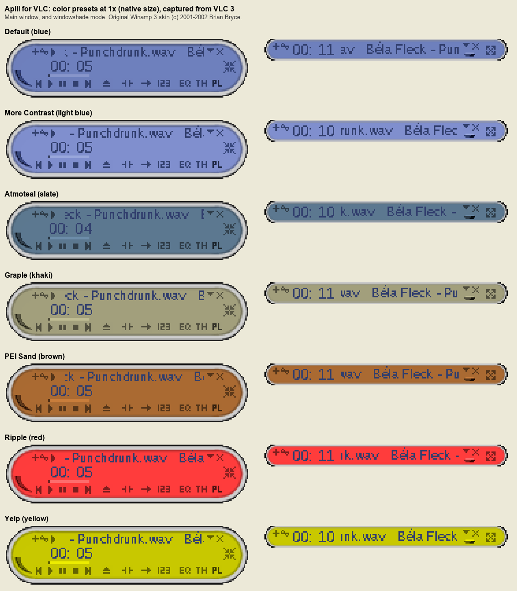

# Apill for VLC

An unofficial port of **Apill**, a Winamp 3 skin by **Brian Bryce** (drwho9437), © 2001–2002, to VLC's skin engine. All of the artwork, layout and color themes are his. This project only recolors, rearranges and repackages them for VLC. See [Credits and licenses](#credits-and-licenses).



The skin has a main window, a windowshade mode with a slide-out control drawer, an equalizer, a playlist editor and a video window. All of them follow the original skin's Winamp 3 layout, and it comes in all seven of the original color presets.

## Download

Prebuilt skins are in [`builds/`](builds/). Pick a color and a size:
- **Colors:** "Default" is the original skin's own color scheme; the others are its alternate presets.
- **Sizes:** 1x is the original pixel size, which is very small on modern high-resolution screens. 1.25x or 2x are easier to use.

| Color | 1x (original) | 1.25x | 2x |
|---|---|---|---|
| Default (blue) | [download](builds/1x/Apill-Default.vlt) | [download](builds/1.25x/Apill-Default.vlt) | [download](builds/2x/Apill-Default.vlt) |
| More Contrast (light blue) | [download](builds/1x/Apill-MoreContrast.vlt) | [download](builds/1.25x/Apill-MoreContrast.vlt) | [download](builds/2x/Apill-MoreContrast.vlt) |
| Atmoteal (slate) | [download](builds/1x/Apill-Atmoteal.vlt) | [download](builds/1.25x/Apill-Atmoteal.vlt) | [download](builds/2x/Apill-Atmoteal.vlt) |
| Graple (khaki) | [download](builds/1x/Apill-Graple.vlt) | [download](builds/1.25x/Apill-Graple.vlt) | [download](builds/2x/Apill-Graple.vlt) |
| PEI Sand (brown) | [download](builds/1x/Apill-PEISand.vlt) | [download](builds/1.25x/Apill-PEISand.vlt) | [download](builds/2x/Apill-PEISand.vlt) |
| Ripple (red) | [download](builds/1x/Apill-Ripple.vlt) | [download](builds/1.25x/Apill-Ripple.vlt) | [download](builds/2x/Apill-Ripple.vlt) |
| Yelp (yellow) | [download](builds/1x/Apill-Yelp.vlt) | [download](builds/1.25x/Apill-Yelp.vlt) | [download](builds/2x/Apill-Yelp.vlt) |

To make other sizes, see [Building from source](#building-from-source).

## Install

1. Copy the `.vlt` file(s) into your VLC skins folder:
   - Windows: `%APPDATA%\vlc\skins\`
   - Linux: `~/.local/share/vlc/skins2/`
2. In VLC, go to **Tools → Preferences → Interface**, choose **Use custom skin**, select the `.vlt` file, then restart VLC.
3. To switch colors later, right-click the player and choose **Interface → Choose skin**.

Tested with VLC 3.0.23 on Windows 11.

## Using it

Most controls work as they did in Winamp. Where VLC has no equivalent, the original control was remapped or left as decoration:

| Winamp 3 control | In VLC |
|---|---|
| Crossfade button | Repeat one |
| TH (the Winamp 3 "Thinger" launcher) | Show/hide the video window |
| Volume crescent | Fills from 0 to 100%. Drag above the window to boost up to 200%. |
| ▾ under the windowshade's close button | Opens the drawer: transport buttons, seek and volume |
| EQ presets, AUTO, opacity ("bb") | Drawn, but inactive: VLC skins can't reach those features |
| Spectrum visualizer | Empty: VLC skins have no visualizer |

### Known differences

- The timer shows `00:07` instead of `0:07`. VLC only offers zero-padded time.
- The playlist always shows a "Media Library" entry under your tracks.
- The text uses Liberation Sans instead of Arial, so a few letters differ slightly from the original at these tiny sizes (see [Fonts](#fonts)).

## Building from source

Requirements:
- Python 3 with the packages in `requirements.txt` (`pip install -r requirements.txt`).
- VLC installed, so the build can check each skin against VLC's `skin.dtd`. If it lives somewhere unusual, set `VLC_SKIN_DTD` to its path. Without it, the build skips that check and warns.

```bash
python build.py                    # all 7 color presets at 1.25x, into dist/
python build.py Default            # one preset
python build.py Default --scale 1  # original size -> dist/Apill-Default@1x.vlt
python build.py --scale 1.5        # any size
python build.py --release          # every preset at 1x, 1.25x and 2x, into builds/
```

VLC has no zoom setting for skins, so the size is baked in at build time, like the colors:
- **Whole-number scales** (1, 2, 3, …) enlarge every pixel exactly.
- **Other scales** resize the art nearest-neighbour and draw the text at the larger size, so it stays crisp.

Builds are deterministic: rebuilding without changes produces byte-identical `.vlt` files.

### Project layout

| Path | What it is |
|---|---|
| `source/` | The original `Apill.wal` (version 0.92), unpacked and unmodified. Everything else is generated from it. |
| `build.py` | Tints the art for each preset, generates the slider frames and window frame, builds the fonts and packages each `.vlt`. |
| `theme.xml` | The VLC skin layout template. Its coordinates are copied from the original skin's Winamp 3 XML. |
| `pixelfont.py` | Turns aliased text into a "pixel-square" TrueType font that VLC draws crisp. |
| `credits/CREDITS.txt` | The attribution shipped inside every skin. |
| `vendor/liberation-fonts/` | Liberation Sans 2.1.5 and its license. |
| `builds/` | Prebuilt skins (generated by `build.py --release`). |
| `tools/` | Development helpers (Windows): `run.ps1` launches a throwaway VLC with a build and screenshots its windows, `click.ps1` clicks controls, `make_testmedia.py` creates test audio, and `preset_sheet.py` makes the preset image. |

### How it works

- **Colors.** Apill's art is grayscale. Winamp 3 tinted it at runtime per "gamma group", scaling each color channel by `(4096 + v) / 4096`. `build.py` reads the presets from the original `color-presets.xml` and bakes the colors in.
- **Text.** The original text is aliased (unsmoothed) Arial at 9 and 11 pixels. VLC always smooths TrueType text, so `pixelfont.py` renders each character without smoothing and stores it as a font made of pixel squares. Drawn at its exact size, it stays crisp.
- **Playlist and video windows.** These use Winamp 3's resizable "standard frame". `build.py` renders it the way Winamp composited it, then cuts it into nine stretchable pieces.
- **Click targets.** VLC ignores clicks on fully transparent pixels. Empty slider areas and button rectangles get 1/255 opacity so they stay clickable, the same trick the original skin's near-invisible "mold" layers used.

## Fonts

The skin's text is generated from **Liberation Sans 2.1.5**, which has the same character widths as Arial, so layouts match the original. At 9 and 11 pixels, a few letters look slightly different from Winamp's aliased Arial.

`--font arial` builds with Microsoft Arial instead, for a pixel-exact match with the original. It works only on Windows, with Arial installed. Arial's license does not allow redistributing fonts made from it, so keep those builds to yourself. Everything in `builds/` uses Liberation Sans.

## Credits and licenses

**Apill** © 2001–2002 Brian Bryce (drwho9437):
- **Original credits:** it was published as a Winamp 3 skin with the contact details `brianbryce@bigfoot.com` and `http://wam.umd.edu/~bryceb/`.
- **History:** according to his [archived homepage](http://web.archive.org/web/2002/http://wam.umd.edu/~bryceb/), the skin began as "Bluple" (v.92 by June 2002). It became "Apple" (v.20, August 2002) when he added color themes for Winamp 3 RC2, since "it no longer has to be blue". It became "Apill" (v.75–v.92, August–October 2002) for Winamp 3 final. In his notes (`source/notes.txt`), the author thanks "Steve" for the equalizer script and the Winamp 3 forum regulars.
- **Where to find it:** the original skin is on [Winamp Heritage](https://winampheritage.com/skin/apill/118660) and preserved at the [Internet Archive](https://archive.org/details/winampskin_Apill).
- **Ownership:** the artwork in `source/` and in every skin built from it remains his.
- **Not endorsed:** this port is not affiliated with or endorsed by him. **Brian Bryce:** if you'd like this port credited differently, changed or taken down, please [open an issue](https://github.com/rspilk/vlc-skin-rpill/issues).

Every `.vlt` contains `CREDITS.txt` (this attribution), `Apill-original-notes.txt` (the author's original notes, verbatim) and `OFL.txt` (the font license). VLC's skin info names the original author too.

| Part | License |
|---|---|
| Code and templates in this repository (`build.py`, `pixelfont.py`, `theme.xml`, `tools/`, …) | [MIT](LICENSE), © 2026 rspilk |
| Original Apill artwork and files (`source/`, and the images in each `.vlt`) | © 2001–2002 Brian Bryce. Not covered by the MIT license. |
| Liberation Sans (`vendor/liberation-fonts/`), and the generated `apill9.ttf` / `apill11.ttf` | [SIL Open Font License 1.1](vendor/liberation-fonts/LICENSE). © 2012 Red Hat, Inc. (Reserved Font Name "Liberation"); digitized data © 2010 Google Corporation. |

VLC port by [rspilk](https://github.com/rspilk).
